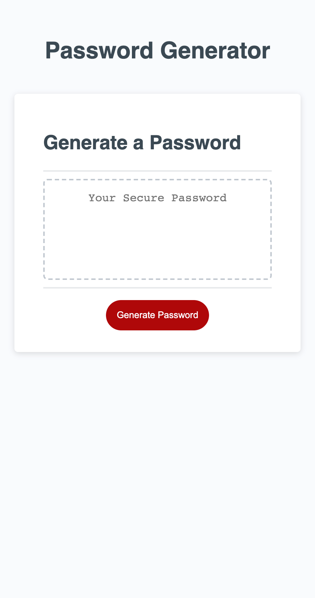
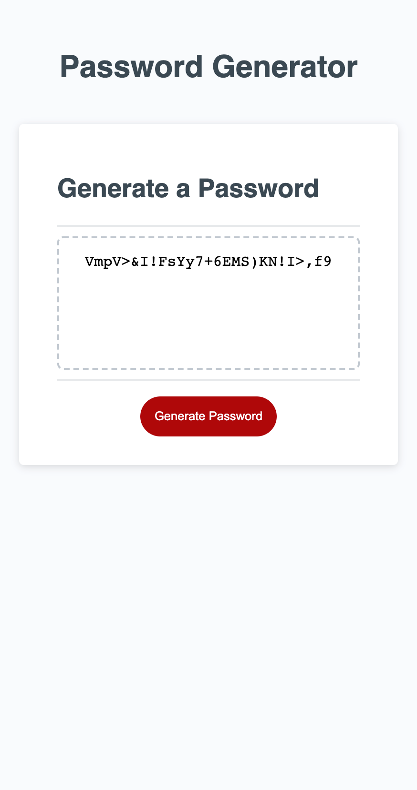

# Password Generator
Module 3 Challenge
## Description
This site was designed to assist client to randomly generate a password that meets certain creiteria. 
[Link](https://zhngzh527.github.io/JavaScript-Challenge-Password-Generator/)
I have using this technologies to creat the web application:
-JavaScript variable
-JaveScript arrays
-JavaScript functions
-JaveScript Scope
-JaveScript methods

## Application Screenshot

